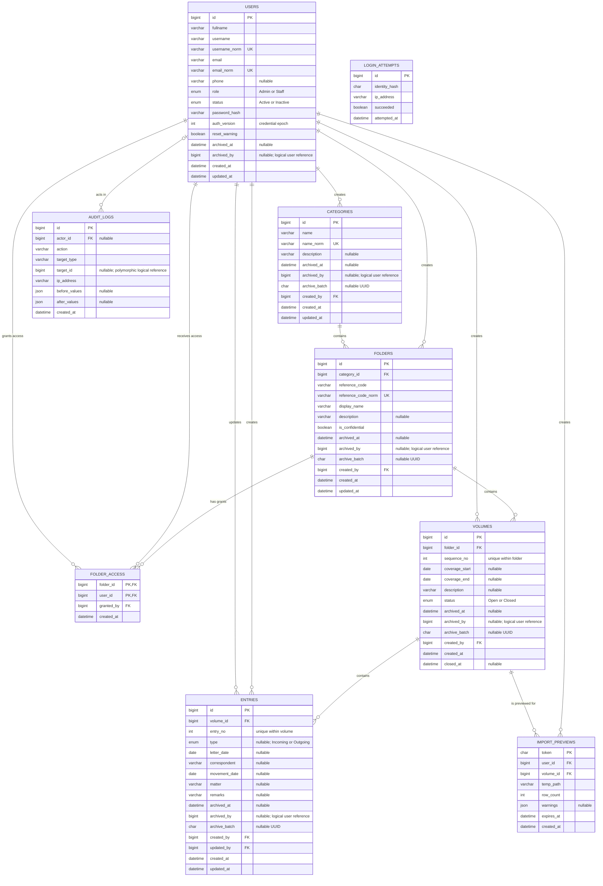

# SPFPU Database Entity-Relationship Diagram

This diagram reflects the MariaDB schema defined by migrations `001_create_spfpu.sql` through `003_add_user_auth_version.sql`.

## Notes

- `folder_access` resolves the many-to-many access relationship between users and confidential folders. Its composite primary key is (`folder_id`, `user_id`).
- `volumes` has a composite unique constraint on (`folder_id`, `sequence_no`), while `entries` has one on (`volume_id`, `entry_no`).
- `archived_by` appears on soft-archivable records as a logical reference to `users.id`, but the migration does not define a foreign-key constraint for it.
- `audit_logs.target_type` and `target_id` form a polymorphic logical reference, so `target_id` has no database-level foreign key.
- `login_attempts.identity_hash` deliberately does not reference `users`; it supports throttling without retaining the submitted login identity.
- `users.auth_version` is copied into each authenticated session and incremented whenever the account password changes or is reset; a mismatch invalidates the session.
- Deleting a folder cascades only to its `folder_access` rows. Other core records use soft archival fields rather than cascade deletion.
